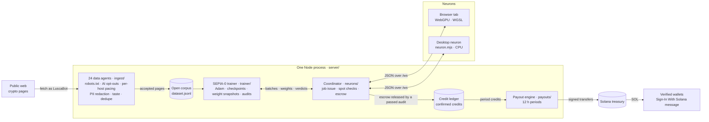
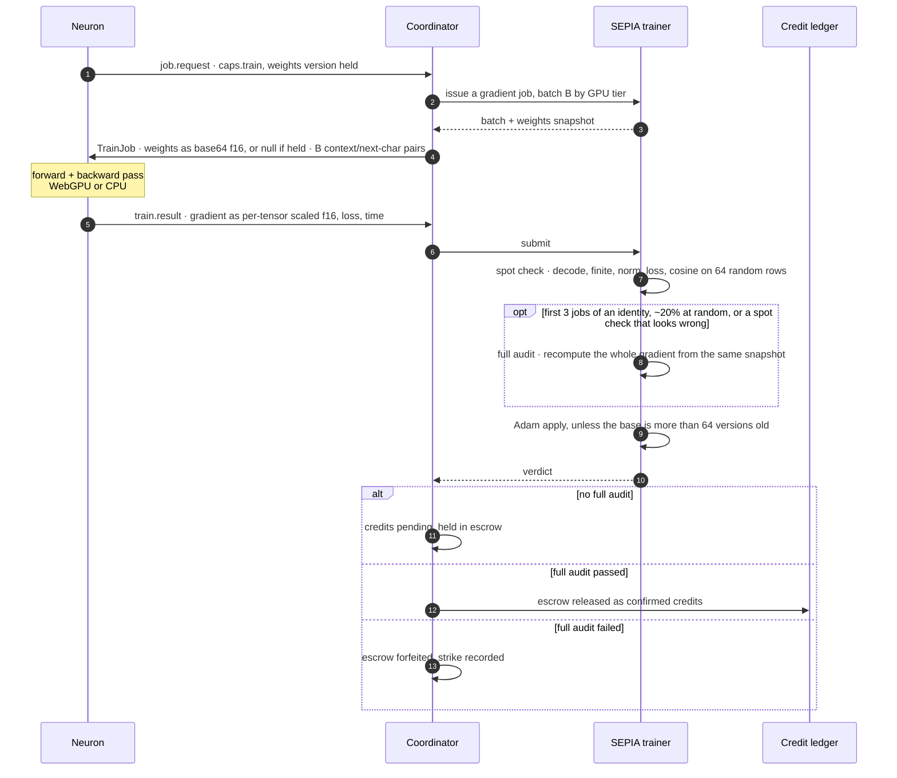

<p align="center"></p>

<p align="center">
  <strong>An open crypto-text corpus, the SEPIA-0 language model trained on it, and the volunteer GPU network that computes its audited training gradients.</strong>
</p>

<p align="center">
  <a href="LICENSE"></a>
  <a href=".node-version"></a>
  <a href="https://lusca.ink"></a>
  <a href="https://lusca.ink/node"></a>
  <a href="#payouts"></a>
</p>

<p align="center">
  <a href="https://lusca.ink"><b>Live site</b></a> ·
  <a href="https://lusca.ink/earn"><b>Start earning</b></a> ·
  <a href="https://lusca.ink/docs"><b>Docs</b></a> ·
  <a href="#run-a-neuron"><b>Run a neuron</b></a> ·
  <a href="CONTRIBUTING.md"><b>Contributing</b></a> ·
  <a href="SECURITY.md"><b>Security</b></a>
</p>

---

## What is LUSCA

LUSCA is three systems coordinated by one Node.js server:

- **Corpus.** 24 data agents, three on each of eight sectors (Governance, Research, Docs, Standards,
  Markets, Codex, Security, Chronicle), fetch public crypto web pages: DAO forums, protocol
  research, developer docs, standards and security write-ups. They honour `robots.txt` and AI
  opt-outs, pace every host, redact e-mail addresses and phone numbers, score each page for
  relevance, drop near duplicates and append the accepted text to an open dataset.
- **Model.** **SEPIA-0** is a character-level MLP language model (context 16 · embedding 24 ·
  hidden 384 · vocabulary 96 · **187,104 parameters**) that trains continuously on that dataset.
- **Network.** Its training gradients are computed by **neurons**: browser tabs using WebGPU (no
  install), or a single-file desktop program on CPU. The server checks every gradient, recomputes
  a share of them in full, applies the accepted ones with Adam and meters the verified work as
  work credits. The API and ledger field is named `ink` for historical reasons; the product
  calls them credits.
- **Payouts.** **$INK** is the project token. Trading fees on $INK fund the payout pool; every
  payout period the pool is split by each wallet's confirmed work credits and **paid in SOL** to
  verified wallets. Credits are not tokens: they are only each wallet's share of the payout pool,
  and contributors are never paid in $INK.

Every number in the UI comes from the running server. When the server is unreachable the client
shows "—" and reconnects; it never substitutes recorded or generated data.

| | |
|---|---|
| Live site | https://lusca.ink |
| Run a neuron in your browser | https://lusca.ink/node |
| Run a neuron on your computer (one file, Node 20+) | https://lusca.ink/neuron.mjs |
| Proof of contribution: verify the credit chain and your own leaf | https://lusca.ink/earn#ep-proofs |
| Lens: read any Solana program or EVM contract, with a cited report | https://lusca.ink/lens |
| Scan: watch the chain agents read contracts live, call by call | https://lusca.ink/scan |
| MCP: plug LUSCA into Claude, Cursor or any MCP client (`claude mcp add --transport http lusca https://lusca.ink/mcp`) | https://lusca.ink/mcp |
| SEPIA-1 tokenizer playground and release files | https://lusca.ink/sepia#sp-tok · `/models/sepia-1-tokenizer/` |
| Manual (protocol, threat model, economics) | https://lusca.ink/docs |
| Source | https://github.com/LUSCAINK/LUSCA |
| Security reports and site-owner requests | lusca@collider.capital ([SECURITY.md](SECURITY.md)) |

## Architecture



Neurons also run near-duplicate (dedupe) jobs for the data pipeline; the server spot-checks those
on its own CPU. The browser client (`src/`) is the live UI and the WebGPU neuron; the desktop
neuron (`scripts/neuron.ts`, bundled to `dist/neuron.mjs`) uses the same SEPIA implementation in
`shared/sepia/` as the server.

## How GPU training works



1. A neuron sends `job.request` with `caps: { train: true, version }`, where `version` is the
   weights version it already holds.
2. The server replies with a `TrainJob`: the weights for that version as base64 f16 (or `null` if
   the neuron already holds them) and a batch of `B` (16-character context, next character) pairs.
   `B` depends on the GPU tier: EPI 256, MESO 512, BATHY 1024, ABYSSO 2048, HADAL 4096, CPU 128.
3. **Gradient.** The neuron runs the forward and backward pass and returns `train.result` with the
   gradient of the mean cross-entropy, encoded as per-tensor scaled f16, plus its loss and time.
4. **Checks.** The server runs cheap checks on every result (decodes, finite, norm in range, cosine
   against a gradient it computes on a random sub-batch of the same data, plausible loss). Results
   that look wrong are escalated to a full audit rather than rejected outright.
5. **Audits.** A full audit recomputes the whole gradient from the same weight snapshot and requires
   cosine ≥ 0.99 and relative L2 error ≤ 0.05. Each identity's first 3 jobs are audited, then a
   share set by `LUSCA_TRAIN_AUDIT_P` (default 0.2), within a CPU budget.
6. **Apply.** Accepted gradients go through the server's Adam optimizer and advance the weights
   version. Results computed against weights more than `LUSCA_TRAIN_MAX_STALE` (default 64) versions
   old are not applied.
7. **Escrow.** Credits per job are `GFLOP × 10 × (1 + 0.15 × tier)` with `flops = trainFlops(B)`. They
   are credited as *pending* and held in escrow per identity. The identity's next passed full audit
   releases its escrow into *confirmed* credits; a failed audit forfeits all escrowed credits and
   counts as a strike. Only confirmed credits count toward payouts (see [Payouts](#payouts)).

The full protocol and the threat model are in the in-app manual, [`/docs/neurons`](https://lusca.ink/docs/neurons)
and [`/docs/protocol`](https://lusca.ink/docs/protocol) (source: `src/components/docs/content/`).

## How verification works

| layer | rule | source |
|---|---|---|
| Spot check | every gradient must decode, be finite, have an L2 norm ≤ `LUSCA_TRAIN_MAX_NORM` (1000) and a plausible loss, and is compared by cosine with a server gradient on `LUSCA_TRAIN_CHECK_ROWS` (64) random rows of the same batch | `server/trainer/worker.mjs` |
| Escalation | a cosine under the floor min(`LUSCA_TRAIN_MIN_COS` 0.08, ½·√(rows/B)), or a failed projection, norm or loss screen, forces a full audit instead of a rejection; a cosine below −0.1 is rejected outright | `server/trainer/worker.mjs` |
| Forced audits | the first 3 gradient results of every identity (device, wallet or IP) | `FORCE_AUDIT_JOBS` in `server/neurons/coordinator.ts` |
| Sampled audits | each later result with probability `LUSCA_TRAIN_AUDIT_P` (0.2), within `LUSCA_TRAIN_AUDIT_CPU` (0.35) of one core | `server/trainer/worker.mjs` |
| Audit tolerance | cosine ≥ `LUSCA_TRAIN_AUDIT_COS` (0.99) and relative L2 error ≤ `LUSCA_TRAIN_AUDIT_REL` (0.05) against the server recompute | `server/trainer/worker.mjs` |
| Escrow | training credits are *pending* until the identity's next passed full audit releases it; a failed audit forfeits all of it | `server/neurons/coordinator.ts` |
| Strikes | 3 consecutive failed jobs per identity, or 12 per remote IP across identities, disconnect the neuron with a cooldown of 30 s that doubles per repeat, up to 15 min | `server/neurons/coordinator.ts` |
| Tier proof | a tier above MESO earns its credit bonus only after 2 large jobs average at least 3 GFLOPS end to end | `server/neurons/coordinator.ts` |
| Proof of contribution | every epoch (`LUSCA_EPOCH_MIN`, default 60) the confirmed credits of each identity become a leaf of a SHA-256 Merkle tree; each header links to the previous one by hash, and browsers and neurons re-check the chain against the last head they verified | `server/proofs/`, `shared/proofs.ts` |

## Quick start

**Run a neuron in 30 seconds.** Open **https://lusca.ink/node**, detect the GPU, run the benchmark
and start. Nothing to install; WebGPU is used when available, otherwise the tab computes on the CPU.

Or run the desktop neuron (one file, Node 20+):

```bash
curl -O https://lusca.ink/neuron.mjs        # Windows PowerShell 5.1: curl.exe -O https://lusca.ink/neuron.mjs
node neuron.mjs --label my-machine
```

**Run the whole stack locally:**

```bash
git clone https://github.com/LUSCAINK/LUSCA.git
cd LUSCA
npm ci
npm run dev                                 # then open http://localhost:5173
```

## Run locally

Requires Node 22.12+ (CI and production use Node 24, pinned in `.node-version`) and npm; the
desktop neuron alone runs on Node 20+. Works on Windows, macOS and
Linux; the commands below are the same in bash, zsh, PowerShell and cmd unless noted.

To send changes, fork https://github.com/LUSCAINK/LUSCA on GitHub and clone your fork
(`https://github.com/<you>/LUSCA.git`). To just run it, clone the main repository:

```bash
git clone https://github.com/LUSCAINK/LUSCA.git
cd LUSCA
npm ci               # installs the exact versions in package-lock.json
npm run dev
```

Open **http://localhost:5173**. `npm run dev` starts both:

| process | port | what |
|---|---|---|
| `server` (tsx watch) | 8787 | data agents, SEPIA trainer, GPU neuron coordinator, payouts, REST + WebSocket |
| `web` (vite) | 5173 | the app (proxies `/api` and `/ws` to the server; target set by `LUSCA_API`, default `http://127.0.0.1:8787`) |

Stop with Ctrl+C. The server starts with an empty dataset in `server/data/` (git-ignored; set
`LUSCA_DATA` to keep it elsewhere). SEPIA starts training once the agents have collected enough text.

> [!IMPORTANT]
> Starting the server starts the data agents, which fetch public web pages as LuscaBot with a
> user-agent that links to `LUSCA_BOT_URL` (default `https://lusca.ink/docs/ethics`). If you run
> your own copy anywhere beyond a short local session, set `LUSCA_BOT_URL` and `LUSCA_BOT_CONTACT`
> to your own page and address so site owners reach you, and keep `LUSCA_AGENTS` low (minimum 1).

**Production-style single process** (the server serves the built app from `dist/`):

```bash
npm run build                        # typecheck, build the app into dist/, bundle dist/neuron.mjs
node --import tsx server/index.ts    # app + API + /ws on http://127.0.0.1:8787 (what Render runs)
```

`npm start` does the same in one step (it builds without the typecheck, then starts the server).
Check it with `curl http://127.0.0.1:8787/api/health`, or open that URL in a browser. On Windows
PowerShell 5.1, where `curl` is an alias for `Invoke-WebRequest`, type `curl.exe`.

**Environment variables and other ports.** Every setting is an environment variable
([Configuration](#configuration)). How to set one differs by shell:

| shell | example |
|---|---|
| bash / zsh (macOS, Linux, Git Bash, WSL) | `PORT=8821 LUSCA_DATA=/tmp/lusca-dev LUSCA_AGENTS=4 npm start` |
| PowerShell | `$env:PORT=8821; $env:LUSCA_DATA="$env:TEMP\lusca-dev"; $env:LUSCA_AGENTS=4; npm start` (stays set in that window) |
| cmd.exe | `set PORT=8821`, `set LUSCA_DATA=%TEMP%\lusca-dev`, `set LUSCA_AGENTS=4`, then `npm start` |

If 8787 or 5173 is taken, run the two dev processes yourself in two terminals (bash syntax):

```bash
PORT=8821 npm run dev:server                           # terminal 1: server on 8821
LUSCA_API=http://127.0.0.1:8821 npx vite --port 5174   # terminal 2: app on http://localhost:5174
```

## Run a neuron

**Browser:** open https://lusca.ink/node (or `/node` on your local app), detect the GPU, run the
benchmark and start. WebGPU is used when available; otherwise the tab computes on the CPU.

**Desktop (CPU), published build:** one file, Node 20+, no install step.

```bash
curl -O https://lusca.ink/neuron.mjs        # Windows PowerShell 5.1: curl.exe -O https://lusca.ink/neuron.mjs
node neuron.mjs --label my-machine                                  # joins lusca.ink
node neuron.mjs --server ws://127.0.0.1:8787/ws --label my-machine  # joins a local server
node neuron.mjs --help                                              # all flags
```

**Desktop, from your checkout** (with a local server running):

```bash
npx tsx scripts/neuron.ts --server ws://127.0.0.1:8787/ws --label my-machine
# or the single-file build (written by npm run build or npm run build:neuron):
node dist/neuron.mjs --server ws://127.0.0.1:8787/ws --jobs 3       # --jobs n: exit after n verified jobs
```

`scripts/neuron.ts` defaults to `ws://127.0.0.1:8787/ws` (or `ws://127.0.0.1:$PORT/ws` when `PORT`
is set); the bundled `neuron.mjs` defaults to `wss://lusca.ink/ws`, so pass `--server` (or set
`LUSCA_WS`) to point it at a local server. `dist/neuron.mjs.sha256` holds the checksum of the build.

Credits are kept on the device account. To receive SOL, pass `--auth <token>` (a sign-in token copied
from the Node page after signing one plain-text message with your browser wallet) or
`--keypair <file>` (a dedicated payout-only keypair, never a wallet that holds funds).

## Configuration

Every knob has a working default; invalid numbers fall back to it with a warning, and
out-of-range values are clamped. See [Run locally](#run-locally) for how to set them in your shell.
Nothing reads a `.env` file.

<details>
<summary><b>Core</b> — port, data directory, agents, trainer and audit settings</summary>

| var | default | |
|---|---|---|
| `PORT` | `8787` | API/WebSocket port |
| `HOST` | `127.0.0.1` | bind address (`0.0.0.0` to expose on your LAN) |
| `LUSCA_AGENTS` | `24` | genesis agents (3 per arm), 1–64 |
| `LUSCA_PACE` | `1` | visual pacing of agent steps (0 = full speed) |
| `LUSCA_DATA` | `server/data` | dataset, model checkpoint, credit ledger, issuance log, denylist |
| `LUSCA_REQUIRE_DISK` | off | `1` = refuse to boot unless `LUSCA_DATA` is on a different filesystem than the app (the mounted persistent disk) |
| `LUSCA_SHUTDOWN_TIMEOUT_S` | `25` | force exit after this many seconds of graceful shutdown (above the agents' 15 s drain) |
| `LUSCA_LEDGER_RESET` | off | `1` = start a fresh credit ledger when `ledger.json` is unreadable |
| `LUSCA_CORS_ORIGINS` | empty | extra allowed origins, comma list |
| `LUSCA_DATASET_MAX_MB` | `2048` | rotate `dataset.jsonl` into an archive past this size (0 = never) |
| `LUSCA_DATASET_KEEP` | `0` | archives kept (0 = all) |
| `LUSCA_MEMORY_PAGES` | `20000` | pages kept in memory for search and GPU jobs |
| `LUSCA_CORPUS_CHARS` | `24000000` | SEPIA's in-memory corpus cap |
| `LUSCA_TRAIN_DUTY` | `0.85` | share of one core the trainer may use |
| `LUSCA_TRAIN_AUDIT_P` | `0.2` | probability that a GPU training result gets a full server recompute (after the first 3 per identity, which are always audited) |
| `LUSCA_TRAIN_MAX_STALE` | `64` | GPU gradients computed against weights more than this many versions old are not applied (still paid if honest) |
| `LUSCA_TRAIN_AUDIT_CPU` | `0.35` | share of one core that full audits may use (refilled continuously; forced first-3 audits may overdraw it) |
| `LUSCA_TRAIN_AUDIT_COS` | `0.99` | full audit: minimum cosine between the submitted gradient and the server recompute |
| `LUSCA_TRAIN_AUDIT_REL` | `0.05` | full audit: maximum relative L2 error against the server recompute |
| `LUSCA_TRAIN_MIN_COS` | `0.08` | spot check: cosine floor against a server gradient on random rows of the same batch; the effective floor is min(this, ½·√(rows/B)). A result below it (or failing the projection, norm or loss screen) is escalated to a full audit, not rejected; only a cosine below −0.1 is rejected outright |
| `LUSCA_TRAIN_CHECK_ROWS` | `64` | rows the server recomputes for the spot check on every result (8 groups) |
| `LUSCA_TRAIN_SPOT_CPU` | `0.25` | share of one core spot checks may use; new train jobs pause while they are behind |
| `LUSCA_TRAIN_MAX_NORM` | `1000` | spot check: maximum gradient L2 norm |
| `LUSCA_TRAIN_DUTY_GPU` | `0.02` | share of one core the server's own training loop keeps while GPU results are arriving (0 = pause it) |
| `LUSCA_TRAIN_REUSE` | `MAX_STALE/2` (32) | a job reuses weights the neuron already holds (no re-send) when they are at most this many versions old |
| `LUSCA_TRAIN_WEIGHTS_GAP_S` | `20` | a neuron that downloaded weights less than this long ago keeps them while they are within the staleness window |
| `LUSCA_TRAIN_SNAPSHOTS` | `24` | weight snapshots kept for audits (f16, ~0.37 MB each) |
| `LUSCA_TRAIN_JOB_TTL_S` | `90` | how long the trainer keeps an issued train job's batch and base weights |

</details>

<details>
<summary><b>Proxy, connection and bandwidth limits</b></summary>

| var | default | |
|---|---|---|
| `LUSCA_TRUST_PROXY` | `0` | N ≥ 1 = read `X-Forwarded-For` from a trusted proxy: skipping trusted hops from the right, the N-th untrusted entry is the client |
| `LUSCA_TRUSTED_PROXIES` | empty = `loopback,private` | peers / hops whose forwarded headers are believed: IPs, IPv4/IPv6 CIDRs and the keywords `loopback`, `private`, `cloudflare`; a list replaces the default |
| `LUSCA_MAX_CLIENTS` | `1000` | WebSocket clients in total |
| `LUSCA_MAX_CLIENTS_PER_IP` | `16` | WebSocket clients per address (IPv6 counted per /64) |
| `LUSCA_TOTAL_BUFFER_MB` | `128` | bytes queued on all sockets before non-essential traffic is shed and jobs are deferred |
| `LUSCA_HARD_BUFFER_MB` | `8` | per-socket backlog that disconnects a client (plus the size of a GPU job sent in the last 2 min) |
| `LUSCA_WS_MAX_KBPS` | `24` | live-stream budget per viewer in KB/s (0 = off); traces and discoveries are dropped first |
| `LUSCA_API_READS_PER_MIN` | `120` | per-address requests/min to `/api/ledger`, `/api/neurons`, `/api/agents/:id/traces` |

</details>

<details>
<summary><b>Security headers and health</b></summary>

| var | default | |
|---|---|---|
| `LUSCA_CSP` | `on` | Content-Security-Policy: `on`, `report` (Report-Only) or `off` |
| `LUSCA_HSTS_MAX_AGE` | `31536000` | HSTS max-age in seconds, sent only over https (0 = off) |
| `LUSCA_HEALTH_LAG_MS` | `500` | event-loop p99 delay above which `/api/health` reports `event-loop-lag` |
| `LUSCA_HEALTH_CKPT_MIN` | `10` | minutes without a SEPIA checkpoint (while training) before `checkpoint-stale` |
| `LUSCA_HEALTH_DISK_PCT` | `10` | free-disk percentage below which `disk-low` is reported |

`/api/health` always answers 200 (Render's check must not flap); problems are listed in
`status` / `degraded[]` and logged as `[health] degraded: …` / `recovered`.

</details>

<details>
<summary><b>Agent identity and opt-outs</b></summary>

| var | default | |
|---|---|---|
| `LUSCA_BOT_URL` | `https://lusca.ink/docs/ethics` | page linked from LuscaBot's user-agent |
| `LUSCA_BOT_CONTACT` | empty | takedown / abuse contact (e-mail or URL): in the user-agent, sent as `From:` when it is an e-mail, and shown on `/privacy` and `/terms` (via `GET /api/bot`) |
| `LUSCA_DENYLIST_FILE` | `<LUSCA_DATA>/denylist.json` | hosts / URL prefixes LuscaBot never fetches (format in [Data ethics](#data-ethics)) |
| `LUSCA_DENYLIST_RELOAD_SEC` | `60` | re-read period for the denylist (0 = start-up only; else 5–86400) |

</details>

<details>
<summary><b>GPU neurons and credits</b></summary>

| var | default | |
|---|---|---|
| `LUSCA_ISSUE_MB_PER_SEC` | `2` | job payload egress shared by all neurons, MB/s |
| `LUSCA_JOB_FILL_WAIT_S` | `30` | hold a request until JOB_ROWS/2 new rows exist, at most this long (0 = never hold) |
| `LUSCA_NEURONS_TOP` | `50` | neurons listed in broadcasts, the hello and `/api/neurons` (top N by credits) |
| `LUSCA_MAX_ACCOUNTS` | `50000` | ledger account cap; near it, idle low-credit accounts are evicted |
| `LUSCA_ACCOUNT_IDLE_DAYS` | `7` | idle days before an account under 1 credit may be evicted (only above 90 % of the cap) |
| `LUSCA_NEW_ACCOUNTS_PER_HOUR` | `30` | new ledger accounts per IPv4 address / IPv6 /56 per hour |
| `LUSCA_MAX_PENDING_MB` | `64` | vector bytes held for outstanding jobs, all neurons |
| `LUSCA_MAX_BIG_JOBS` | `8` | concurrent ABYSSO / HADAL sized jobs |
| `LUSCA_VERIFY_MS_PER_SEC` | `200` | main-thread ms per second for CPU spot-checks (50 on a 0.5 CPU instance) |
| `LUSCA_ISSUANCE_LOG_MB` | `50` | rotate `issuance.log` (one JSON line per credit) at this size into `.log.gz` (0 = log off) |
| `LUSCA_ISSUANCE_LOG_KEEP` | `10` | rotated issuance archives kept (0 = all) |
| `LUSCA_HASH_SALT` | `<LUSCA_DATA>/hash.salt` | salt for hashed device ids / IPs in public payloads and the issuance log; the file is created on first start — back it up with the ledger |

</details>

<details>
<summary><b>Proof of contribution and Lens</b></summary>

| var | default | |
|---|---|---|
| `LUSCA_EPOCH_MIN` | `60` | minutes per contribution epoch, boundaries on the UTC clock |
| `LUSCA_PROOFS_RESTART` | off | `1` = start a new proof chain when `<LUSCA_DATA>/proofs` is missing; otherwise proofs stay off (`proofs-off` in `/api/health`) so a lost chain is never silently replaced |
| `LUSCA_LENS` | on | `0` = Lens off; `/api/lens/*` answers 503 |
| `LUSCA_LENS_SOL_CALLS` | 15 % of the agents' Solana limit (1,200 at the default) | Lens's daily share of Solana RPC calls, charged on top of the chain agents' budget |
| `LUSCA_LENS_EVM_CALLS` | 15 % of the agents' EVM limit (2,250 at the default) | Lens's daily share of RPC calls per EVM chain |
| `LUSCA_LENS_HTTP_CALLS` | 40 % of the registry limit | Lens's daily share of Sourcify and OtterSec calls, each |
| `LUSCA_MCP` | on | `0` = no MCP endpoint; `/mcp` is then only the setup page |
| `LUSCA_MCP_REQ_PER_MIN` · `_TOOLS_PER_MIN` · `_GLOBAL_PER_MIN` | 90 · 40 · 2,400 | POST `/mcp` per client address, `tools/call` per client address, tool calls that run (not answered from the cache) for all clients together, per minute; `/mcp` accepts any browser Origin (public, read-only, no credentials) |
| `LUSCA_MCP_SHARED_CLIENT_RANGES` · `LUSCA_MCP_SHARED_FACTOR` | Anthropic's outbound range `160.79.104.0/21` · 20 | hosted MCP clients (claude.ai / Claude Desktop connectors) call from shared addresses: their per-address windows are this many times larger; `none` = no shared ranges |
| `LUSCA_RADAR` | on | `0` = upgrade radar off; `/api/radar*` answers 503 |
| `LUSCA_SEARCH` · `LUSCA_SEARCH_MAX_MB` | on · 192 | `0` = code search off (`/api/search/stats` says so, the rest answers 503); cap in MB for the unique source files held in memory. Index snapshot in `<LUSCA_DATA>/search/index.v2.gz` (about 40 MB) |
| `LUSCA_ADVISORY` | on | `0` = advisory check off; `/api/advisories*` answers 503 with the reason. Stored sources and vendored data only (no RPC) |
| `LUSCA_BINARY` · `LUSCA_BINARY_SOL_CALLS` | on · 250 | `0` = read-the-binary off; its background reader's daily Solana calls (at most 30 % per clock hour, never the last 10 % of the shared Solana budget). Results in `<LUSCA_DATA>/binary/` (capped at 32 MB) |
| `LUSCA_RADAR_BACKFILL` | on | `0` = no first-start backfill (it runs once per data directory; once more only when its very first call was refused). EVM: the last 24 h. Solana: at most 500 loader transactions inspected, a few hours back |
| `LUSCA_RADAR_SOL_CALLS` | 25 % of the agents' Solana limit (2,000 at the default) | the radar's daily share of Solana RPC calls (re-reads, getTransaction; getProgramAccounts counts as 10), on top of the agents' budget and never below a 10 % floor of it |
| `LUSCA_RADAR_EVM_CALLS` | 10 % of the agents' EVM limit (1,500) | the radar's daily share of implementation reads per EVM chain |
| `LUSCA_RADAR_HTTP_CALLS` | 15 % of the registry limit (750) | the radar's daily share of Sourcify and OtterSec calls, each |
| `LUSCA_RADAR_LOG_CALLS` | 20,000 | calls per day to the radar's own EVM log endpoints, per chain (eth_getLogs, code / storage one block earlier) |
| `LUSCA_RADAR_ETH_LOGS` · `_BASE_LOGS` · `_ARB_LOGS` | MEV Blocker + dRPC · Base public RPC + dRPC · Arbitrum public RPC + dRPC | comma lists of endpoints that answer address-less `eth_getLogs` and historical state |
| `LUSCA_RADAR_SOLANA_WS` | derived from `LUSCA_SOLANA_RPC` (https → wss) | Solana websocket for `logsSubscribe` (Helius standard WebSockets). Setting it to the public `wss://api.mainnet-beta.solana.com` costs no Helius credits but is rate-limited |
| `LUSCA_RADAR_WS_MB` | 200 | daily allowance of data received on a paid (Helius) websocket, in MB; past it the radar listens on the public websocket until 00:00 UTC |

**Upgrade radar: expected cost.** `logsSubscribe` on the upgradeable loader delivers every transaction that mentions it, buffer writes included (about 2 to 4 per second, ~0.6 KB each): roughly 150 to 200 MB a day. Helius bills standard WebSockets by data streamed (2 credits per 0.1 MB), so a full day is about 3,000 to 4,000 credits; `LUSCA_RADAR_WS_MB` caps it (200 MB ≈ 4,000 credits). Loader signatures for gap checks and the backfill go to the discovery RPC (`LUSCA_SOLANA_DISCOVERY_RPC`, the public RPC by default): Helius refuses `getSignaturesForAddress` for the loader. Each Solana change read costs about 2 Helius calls plus one `getTransaction` for the signer (skipped once 75 % of the slice is used); at ~500 changes a day that is ~1,500 of the 2,000-call slice. Gap checks run after every (re)subscribe, every 10 min while the socket is up, every 45 s while it is down (a page of 1,000 loader signatures each, plus `getTransaction` only for what the socket did not deliver).

</details>

<details>
<summary><b>Wallet sign-in and payouts</b> (see <a href="#payouts">Payouts</a>)</summary>

| var | default | |
|---|---|---|
| `LUSCA_AUTH_SECRET` | `<LUSCA_DATA>/auth.secret` | HMAC key for 30-day wallet session tokens; unset = generated once into the data dir (mode 0600). Changing it signs every wallet out |
| `LUSCA_PUBLIC_HOST` | request `Host` header | host named in the sign-in message (`lusca.ink` in production); the desktop neuron refuses a message for any other host |
| `LUSCA_CANONICAL_HOST` | empty | page requests arriving on `*.onrender.com` are redirected (301) to this host; API, WebSocket and health requests are not |
| `LUSCA_PAYOUTS` | `off` | `off` · `dryrun` (plan and publish each period, never sign or send) · `live` (send SOL) |
| `LUSCA_SOLANA_RPC` | `https://api.mainnet-beta.solana.com` | Solana JSON-RPC endpoint |
| `LUSCA_SOLANA_CLUSTER` | from the RPC URL | `mainnet-beta` · `devnet` · `custom` (Solscan links only) |
| `LUSCA_TREASURY_SECRET` | empty | treasury secret key, base58 or a JSON array of 64 bytes. Required for `live`. Store it as a secret, never in the repo |
| `LUSCA_TREASURY_ADDRESS` | empty | treasury address for balance reads without a key (`off` / `dryrun`) |
| `LUSCA_PAYOUT_EVERY_H` | `12` | period length in hours, aligned to UTC (12 → 00:00 / 12:00 UTC); 0.01–720 |
| `LUSCA_PAYOUT_SHARE` | `0.5` | share of (treasury balance − reserve − est. fees) paid per period |
| `LUSCA_PAYOUT_RESERVE_SOL` | `0.05` | never spent (≥ 0.002) |
| `LUSCA_PAYOUT_MAX_SOL` | `5` | pool cap per period |
| `LUSCA_PAYOUT_MAX_WALLET_SOL` | `1` | cap per wallet per period; credits above it carry over |
| `LUSCA_PAYOUT_MIN_SOL` | `0.001` | amounts below this carry over (≥ 0.0009) |
| `LUSCA_AUTH` | empty | desktop neuron only: session token sent as `auth` in `neuron.register` (same as `--auth`) |

</details>

<details>
<summary><b>Client</b> (read at build time by Vite)</summary>

| var | default | |
|---|---|---|
| `VITE_LUSCA_HIDDEN_CLOSE_S` | `60` | a hidden tab closes its socket after this long and reconnects when visible (0 = never) |
| `VITE_LUSCA_RECONNECT_JITTER` | `0.5` | ± random fraction on reconnect delays (max 0.9) |
| `VITE_LUSCA_RELOAD_GUARD_S` | `60` | after a stale-deploy chunk error the page reloads once; a second automatic reload within this window is refused |

</details>

<details>
<summary><b>Development and desktop neuron</b></summary>

| var | default | |
|---|---|---|
| `LUSCA_API` | `http://127.0.0.1:8787` | `npm run dev` / vite only: where `/api` and `/ws` are proxied |
| `LUSCA_WS` | `ws://127.0.0.1:$PORT/ws` (source) · `wss://lusca.ink/ws` (bundle) | desktop neuron: coordinator WebSocket (same as `--server`) |
| `LUSCA_NEURON_SERVER` | `wss://lusca.ink/ws` | `build-neuron.mjs`: default `--server` baked into `dist/neuron.mjs`; set it when you host your own server |

</details>

## Project layout

```text
LUSCA/
├── .github/        CI workflow, Dependabot, issue and pull request templates; assets/ holds the banner and social preview
├── public/         static files served as-is: favicon, share images, robots.txt, sitemap.xml
├── models/         sepia-1-tokenizer/: the SEPIA-1 tokenizer release (tokenizer.json, model card, eval)
├── scripts/        neuron.ts (desktop neuron source) and build-neuron.mjs (bundles it into dist/neuron.mjs); tokenizer/ and hf/ for the SEPIA-1 tokenizer
├── server/         one Node process
│   ├── index.ts    entry point: wires agents, trainer, coordinator, payouts and auth; graceful shutdown
│   ├── http.ts     the hub: REST /api/*, the /ws socket and static hosting of dist/
│   ├── ingest/     data agents: robots.txt, host pacing, extraction, PII redaction, taste, simhash dedupe, denylist
│   ├── trainer/    SEPIA-0 training worker: Adam, checkpoints, weight snapshots, spot checks, full audits
│   ├── neurons/    coordinator: job issue, result checks, escrow, strikes, credit ledger, issuance log
│   ├── payouts/    payout periods, plans and SOL transfers from the treasury
│   ├── auth/       wallet sign-in (nonce, ed25519 signature, session tokens)
│   ├── proofs/     contribution epochs: Merkle leaves, hash-linked headers, proof lookups
│   ├── lens/       LUSCA Lens: on-demand reads of one program or contract, cited reports
│   ├── mcp/        MCP server at /mcp: JSON-RPC over HTTP, read-only tools for AI agents (Claude, Cursor)
│   └── data/       runtime data (git-ignored): dataset, checkpoint, ledger, salts
├── shared/         code used by server, browser and desktop neuron: protocol.ts, sectors, vectorizer, payouts
│   └── sepia/      the one SEPIA implementation: forward, backward, f16 gradient codec, trainFlops
├── src/            React 19 + Vite client: pages, components, in-app manual (components/docs/content/)
│   └── lib/gpu/    WebGPU detection, benchmark, dedupe kernel, and train/ (WGSL forward/backward for SEPIA)
├── DESIGN.md       the design system
└── render.yaml     Render Blueprint for the production service
```

## Payouts

> [!NOTE]
> The payout pool is funded by trading fees on the **$INK** token, routed to the treasury wallet.
> Payouts run when `LUSCA_PAYOUTS=live` and a treasury key is configured; with payouts off, work
> credits are still metered and recorded and the UI shows "Payouts not started".

`server/payouts` closes a payout period every `LUSCA_PAYOUT_EVERY_H` hours (default 12, at 00:00 and
12:00 UTC) and pays SOL from the treasury wallet to verified wallets, split by the credits each wallet
earned in that period. Credits are your share of the payout pool. Payouts are made in SOL.
`GET /api/payouts` returns the rules in force, the treasury balance, the current period and the
history; `GET /api/payouts/wallet/:address` returns one wallet's credits and
payouts; the WebSocket pushes `{ t: 'payout', overview }` on every change.

| rule | default |
|---|---|
| Pool per period | `min(LUSCA_PAYOUT_MAX_SOL, LUSCA_PAYOUT_SHARE × (balance − LUSCA_PAYOUT_RESERVE_SOL − est. fees))`: 50 % of the balance above a 0.05 SOL reserve, at most 5 SOL |
| Split | by period credits among verified wallets |
| Per-wallet cap | `LUSCA_PAYOUT_MAX_WALLET_SOL` (1 SOL) per period; credits above the cap carry over |
| Minimum transfer | `LUSCA_PAYOUT_MIN_SOL` (0.001 SOL); smaller amounts carry over |
| Counted credits | confirmed credits only; pending (escrowed) training credits are not paid until an audit releases them |

- **Funding:** the owner's token creator fees are routed to the treasury wallet. No amount is
  guaranteed. When payouts are live and the treasury holds nothing above the reserve, the UI says
  so and the period pool is 0 SOL.
- **Verification:** a wallet signs one plain-text message (`GET /api/auth/nonce` →
  `POST /api/auth/verify`), which returns a 30-day token. The browser and the desktop neuron send it
  as `auth` in `neuron.register`; only credits earned under a valid token go to the wallet.
  Desktop: `--auth <token>` reuses a token from the Node page (preferred), or
  `npx tsx scripts/neuron.ts --keypair <file>` signs locally with a dedicated payout-only keypair
  (`solana-keygen new -o lusca-payout.json`), never a wallet that holds funds.
- **Safety:** each period plan and every signed transaction are written to `<LUSCA_DATA>` before
  broadcast, so a restart re-checks signatures and never pays a row twice.

| `LUSCA_PAYOUTS` | behaviour |
|---|---|
| `off` (default) | no periods close; the treasury balance is still shown when an address is set |
| `dryrun` | periods close and the plan is published ("planned — no transfer"); nothing is signed or sent. Note: period credits reset at each dryrun close, as in `live` |
| `live` | needs `LUSCA_TREASURY_SECRET`; transfers are sent and linked on Solscan |

> [!CAUTION]
> Set `LUSCA_TREASURY_SECRET` only as a Render secret env var (`sync: false` in `render.yaml`; enter
> it in the dashboard). Never commit it or paste it into logs. Keep only working funds in that wallet.

<details>
<summary><b>Devnet rehearsal</b> (throwaway keys only; bash on macOS, Linux or WSL, with the Solana CLI)</summary>

```bash
solana-keygen new --no-bip39-passphrase -o /tmp/treasury.json   # throwaway treasury
solana-keygen new --no-bip39-passphrase -o /tmp/worker.json     # throwaway payout keypair for the neuron
solana airdrop 2 $(solana-keygen pubkey /tmp/treasury.json) -u devnet
LUSCA_PAYOUTS=live LUSCA_SOLANA_RPC=https://api.devnet.solana.com \
LUSCA_TREASURY_SECRET="$(cat /tmp/treasury.json)" LUSCA_PAYOUT_EVERY_H=0.05 \
LUSCA_DATA=/tmp/lusca-devnet PORT=8805 npm start
# in a second terminal:
npx tsx scripts/neuron.ts --server ws://127.0.0.1:8805/ws --keypair /tmp/worker.json
```

`npx tsx server/payouts/_devnet.ts [dataDir]` runs the same rehearsal against the engine alone.

</details>

## Data ethics

LuscaBot fetches public pages only, politely:

- **`robots.txt`** per origin (cached 1 h), obeying groups for `LuscaBot` and `*`.
- **AI-training opt-outs:** the `robots.txt` groups of the AI-training bots it lists (GPTBot,
  CCBot, Google-Extended, ClaudeBot, anthropic-ai, Applebot-Extended, meta-externalagent,
  Bytespider, PerplexityBot, cohere-ai, Amazonbot), `Content-Signal: ai-train=no` in `robots.txt`
  or a response header, TDMRep headers and meta tags, and robots `noai`. Links into opted-out pages
  are not queued.
- **Per-host pacing:** at most 1 request in flight per host and at least max(2 s, `Crawl-delay` up
  to 60 s) between requests, including `robots.txt` and redirect hops; 12 s timeout, `text/html`
  only, 2 MB body cap, public addresses only.
- **Personal data:** e-mail addresses and phone numbers are redacted before text enters the dataset,
  the model or the live feed. Forum user profiles and accusation boards are never stored.

**Contact and takedown.** `/privacy` and `/terms` point here. Questions, removal of your ledger
entries, and requests from site owners to keep LuscaBot off their pages go to the operator contact
configured as `LUSCA_BOT_CONTACT` on the running server. For https://lusca.ink that is
**lusca@collider.capital**. It is the address in LuscaBot's user-agent
(`LuscaBot/0.1 (+https://lusca.ink/docs/ethics; <contact>; respects robots.txt)`), and `/privacy`,
`/terms` and `GET /api/bot` show it too. A server run from a fork or a local checkout is operated
by whoever runs it, not by lusca.ink.

Operators handle a takedown with the denylist, `<LUSCA_DATA>/denylist.json`, a JSON array that is
re-read every 60 s with no restart (on Render, edit it from the service Shell):

```json
[
  "example.com",
  "news.example.net/private/",
  { "host": "example.io", "reason": "owner request", "added": "2026-10-05" }
]
```

A bare host covers its subdomains, and `host/path` is a prefix on that exact host. Listed URLs
are never fetched (not even `robots.txt`), queued URLs are dropped, and stored pages are hidden
from search, recent pages and GPU jobs. `dataset.jsonl` itself is not rewritten; purging stored
text is a separate step.

## Deploy (Render)

`render.yaml` is a Render Blueprint: one web service runs the API, the WebSocket and the built
frontend from a single Node process, with a 2 GB persistent disk for the dataset, the SEPIA
checkpoint and the credit ledger.

| setting | value |
|---|---|
| build | `npm ci --include=dev && npm run build` |
| start | `node --import tsx server/index.ts` |
| health check | `/api/health` |
| plan | Standard (1 CPU / 2 GB) |
| shutdown delay | `maxShutdownDelaySeconds: 30` (the server force-exits after 25 s) |

Create the service **from the Blueprint**, so the disk and the env vars apply; a service
created through the dashboard or API without the disk would write the ledger to ephemeral
storage (`LUSCA_REQUIRE_DISK=1` makes it refuse to boot instead). Production starts with an
empty ledger and dataset: do not upload the local `server/data`.

<details>
<summary><b>Environment for the deployed service</b> (everything else keeps the defaults)</summary>

| var | value | |
|---|---|---|
| `HOST` | `0.0.0.0` | listen on all interfaces |
| `LUSCA_TRUST_PROXY` | `1` | Render's edge is one proxy hop; per-IP limits see the real client |
| `LUSCA_DATA` | `/var/data/lusca` | on the persistent disk |
| `LUSCA_REQUIRE_DISK` | `1` | refuse to boot if the disk is not mounted |
| `LUSCA_AGENTS` | `24` | data agents |
| `LUSCA_CORPUS_CHARS` | `24000000` | SEPIA's in-memory corpus cap |
| `LUSCA_MEMORY_PAGES` | `20000` | pages kept in memory for search and GPU jobs |
| `LUSCA_TRAIN_DUTY` | `0.6` | share of one core the trainer may use |
| `NODE_OPTIONS` | `--max-old-space-size=1200` | heap ceiling inside 2 GB |
| `LUSCA_DATASET_MAX_MB` | `350` | rotate `dataset.jsonl` into an archive past 350 MB |
| `LUSCA_DATASET_KEEP` | `3` | keep the 3 newest archives so the disk never fills |
| `LUSCA_ISSUE_MB_PER_SEC` | `1` | GPU job egress cap (bandwidth is billed per GB) |
| `LUSCA_BOT_CONTACT` | set in the dashboard | takedown contact; Render asks for it when the Blueprint is created |
| `LUSCA_PUBLIC_HOST` | `lusca.ink` | host named in the wallet sign-in message |
| `LUSCA_AUTH_SECRET` | secret, set in the dashboard | wallet session-token key (unset = generated on the disk) |
| `LUSCA_PAYOUTS` | `off` | switch to `dryrun`, then `live`, once the treasury is funded |
| `LUSCA_SOLANA_RPC` | `https://api.mainnet-beta.solana.com` | use a dedicated RPC provider for `live` |
| `LUSCA_PAYOUT_*` | defaults (12 h, 0.5, 0.05, 5, 1, 0.001) | payout rules, see [Payouts](#payouts) |
| `LUSCA_TREASURY_SECRET` | secret, set in the dashboard | treasury key; required for `live` |

On Starter (0.5 CPU / 512 MB) use `LUSCA_AGENTS=12`, `LUSCA_CORPUS_CHARS=8000000`,
`LUSCA_MEMORY_PAGES=6000`, `LUSCA_TRAIN_DUTY=0.15`, `NODE_OPTIONS=--max-old-space-size=300`,
`LUSCA_DATASET_MAX_MB=200` and a 1 GB disk, plus `LUSCA_TOTAL_BUFFER_MB=48`,
`LUSCA_HARD_BUFFER_MB=4`, `LUSCA_MAX_CLIENTS=300`, `LUSCA_MAX_CLIENTS_PER_IP=8`,
`LUSCA_MAX_PENDING_MB=24`, `LUSCA_MAX_BIG_JOBS=2`, `LUSCA_ISSUE_MB_PER_SEC=0.5` and
`LUSCA_VERIFY_MS_PER_SEC=50`.

</details>

After the first deploy:

1. Find the `[proxy] first forwarded request` line in the logs. It shows `remoteAddress`,
   `X-Forwarded-For` and the client it resolved to. If that client is a Cloudflare address (a
   `[proxy]` warning says so), set `LUSCA_TRUST_PROXY=2`. Leave `LUSCA_TRUSTED_PROXIES` unset
   unless the peer is outside the private ranges (another warning says so).
2. Set `LUSCA_BOT_CONTACT` if it is empty, then check `GET /api/bot`: the same contact appears
   in LuscaBot's user-agent and on `/privacy` and `/terms`.
3. Watch `/api/health` (`status`, `degraded[]`) from an external uptime monitor, and turn on a
   Render bandwidth / billing alert.
4. Rotate any Render API key that was shared while setting this up.

## Tests and checks

```bash
npm test             # coordinator, wallet auth, payout engine, SEPIA math and trainer tests (~1.5 min)
npm run typecheck    # client + server
npm run lint         # oxlint (warnings are reported; errors fail)
npx tsx shared/sepia/_test.ts     # SEPIA math only: gradient check, f16 codec, determinism
```

The tests need no wallet and no running server (they start their own where needed) and write only
to temporary directories. `server/trainer/_smoke.ts` downloads a few Wikipedia articles as training
text and falls back to built-in text when offline.

## Tech stack

| layer | |
|---|---|
| Client | Vite 8 · React 19 · TypeScript · three.js · zustand |
| GPU | WebGPU, WGSL compute shaders (`src/lib/gpu/train/`) |
| Server | Node 24 · tsx · `ws` · `worker_threads` for the trainer |
| Model | SEPIA-0, shared JavaScript implementation in `shared/sepia/` |
| Chain | `@solana/web3.js` for treasury balance reads and SOL transfers |

## Contributing

Issues and pull requests are welcome: fork https://github.com/LUSCAINK/LUSCA, work on a branch and
open a pull request against `main`. Read [CONTRIBUTING.md](CONTRIBUTING.md) for setup, tests and
code style.

## Security

Please do not open a public issue for a vulnerability. Read [SECURITY.md](SECURITY.md) and e-mail
**lusca@collider.capital**.

## License

[MIT](LICENSE) © LUSCA contributors.
